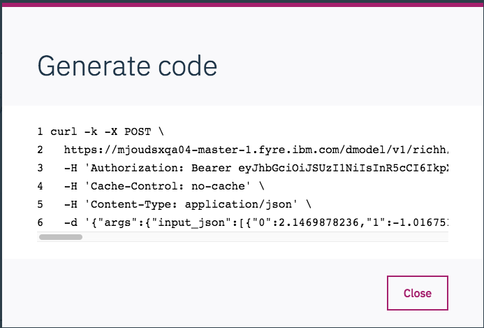

# Develop and Deploy a PCA Model using Data Science Expericence Local and Hortonworks Data Platform 

Principal component analysis (PCA) is a popular machine learning tool used to create predictive models by reducing the number of features in a data set. 

The goal of this code pattern is to demonstrate the key integration points that allow data scientists to run IBM's Data Science Experience Local (DSX-Local) built on the Hortonworks Data Platform (HDP).

> **What is HDP?** Hortonworks Data Platform (HDP) is a massively scalable platform for storing, processing and analyzing large volumes of data. HDP consists of the essential set of Apache Hadoop projects including MapReduce, Hadoop Distributed File System (HDFS), HCatalog, Pig, Hive, HBase, Zookeeper and Ambari.

  

   *Hortonworks Data Platform by [Hortonworks](https://hortonworks.com/products/data-platforms/hdp/)*

> **What is IBM DSX Local?** DSX Local is an on premises solution for data scientists and data engineers. It offers a suite of data science tools that integrate with RStudio, Spark, Jupyter, and Zeppelin notebook technologies. And yes, it can be configured to use HDP, too.

> **What is the IBM Deployment Manager?** The Deployment Manager is a DSX Local tool that provides users the ability to create and train machine learning models. Users can also deploy their models to make them available to a wider audience.

This repo contains two Jupyter notebooks illustrating how to use Spark for training and scoring a model built on a [wine classification data set](https://www.kaggle.com/brynja/wineuci). The data consists of a set of wines with their associated chemical features and assigned wine classification. 

The first notebook uses various machine learning techniques to reduce the number of features required to accurately classify any particular wine.

The second notebook trains, builds and saves a model that can be scored. The model can then be deployed and accessed remotely.

When you have completed this code pattern, you will understand how to:

* Load data into Spark DataFrames and use Spark's machine learning library (MLlib) to train a PCA classification model
* Build, Train, and Save a model using DSX Local
* Use the DSX Local Deployment Manager to deploy and access your model in batch mode

## Flow


1. Load the wine classifcation dataset into Apache Hadoop HDFS running on HDP.
2. Use Spark DataFrame operations to clean the dataset and use Spark MLlib to train a PCA classification model.
3. Save the resulting model into DSX Local.
4. The user can run the provided notebooks in DSX Local.
5. As the notebook runs, Apache Livy will be called to interact with the Spark service in HDP.
6. Use IBM Deployment Manager to deploy and access the model to generate wine classification.

## Included components

* [IBM Data Science Experience Local](https://content-dsxlocal.mybluemix.net/docs/content/local/overview.html): An out-of-the-box on premises solution for data scientists and data engineers. It offers a suite of data science tools that integrate with RStudio, Spark, Jupyter, and Zeppelin notebook technologies.
* [Apache Spark](http://spark.apache.org/): An open-source, fast and general-purpose cluster computing system.
* [Hortonworks Data Platform (HDP)](https://hortonworks.com/products/data-platforms/hdp/): HDP is a massively scalable platform for storing, processing and analyzing large volumes of data. HDP consists of the essential set of Apache Hadoop projects including MapReduce, Hadoop Distributed File System (HDFS), HCatalog, Pig, Hive, HBase, Zookeeper and Ambari.
* [Apache Livy](https://livy.incubator.apache.org/): Apache Livy is a service that enables easy interaction with a Spark cluster over a REST interface.
* [Jupyter Notebooks](http://jupyter.org/): An open-source web application that allows you to create and share documents that contain live code, equations, visualizations and explanatory text.

## Featured technologies

* [Artificial Intelligence](https://medium.com/ibm-data-science-experience): Artificial intelligence can be applied to disparate solution spaces to deliver disruptive technologies.
* [Python](https://www.python.org/): Python is a programming language that lets you work more quickly and integrate your systems more effectively.

# Prerequisites

## Access to HDP Platform

The core of this code pattern is integrating Hortonworks Data Platform (HDP) and IBM DSX Local. If you do not already have an HDP cluster available for use, you will need to install one before attempting to complete the code pattern. 

To install [HDP v2.6.4](https://docs.hortonworks.com/HDPDocuments/HDP2/HDP-2.6.4/index.html), please follow the [installation guide](https://docs.hortonworks.com/HDPDocuments/Ambari-2.6.1.5/bk_ambari-installation/content/ch_Getting_Ready.html) provided by Hortonworks. It first requires the installation of the [Apache Ambari](https://ambari.apache.org/) management platform which is then used to faciliate the HDP cluster installation. The Ambari Server is also required to complete a number of steps described in the following sections.

> Note: Ensure that your Ambari Server is configured to use `Python v2.7`.

## Install HDP Cluster services

Once your HDP cluster is deployed, at a minimum, install the following services as listed in this Ambari Server UI screenshot:


> Note: This code pattern requires that version `2.2.0` of the `Spark2` service be installed.

## Install DSX Local

Details - 3 node cluster. Include MMD for model deployment.

## Install DSX-HI to integrate DSX Local with HDP

This sets up Livy.

# Steps
Follow these steps to setup the proper environment to run our notebooks locally.

1. [Clone the repo](#1-clone-the-repo)
1. [Download and move data to HDFS on Hortonworks](#2-download-and-move-data-to-hdfs-on-hortonworks)
1. [Launch the notebook](#3-launch-the-notebook)
1. [Run the notebook](#4-run-the-notebook)

### 1. Clone the repo
```
git clone git@github.com:IBM/model-mgmt-on-dsx-local-and-hortonworks.git
```

### 2. Download and move data to HDFS on Hortonworks


### 3. Create IBM DSX Local project

* From the DSX Local home page, select the `Add Project` button.


* To create a project in DSX Local, give the project a name and press the `Create` button. 


### 4. Create project assets

* Once created, you can view all of the project assets by selecting the `Assets` tab from the project's home page. 


* Add our wine feature extraction and modeling notebooks into the project. Add the first notebook by selecting `Notebooks` in the project `Assets` list, then pressing the `Add Notebook` button.

* Enter a notebook name and use the `From URL` option to load the notebook from the github repo.


* Enter this URL:

```
https://raw.githubusercontent.com/IBM/model-mgmt-on-dsx-local-and-hortonworks/master/notebooks/pca-features.ipynb
```

Repeat this step to add the second notebook, using the following URL:
```
https://raw.githubusercontent.com/IBM/model-mgmt-on-dsx-local-and-hortonworks/master/notebooks/pca-modeling.ipynb
```

* Add our batch scripts into the project, one at a time, by selecting `Scripts` in the project `Assets` list, then pressing the `Add Script` button.


* Select the `From File` tab and use the `Drag and Drop` option to load the following script files:

```
scripts/feature_engineering.py
scripts/extract_and_score.py
scripts/model_scoring.py
```


### 5. Run the notebooks to create our model

Run both notebooks to create and save our model.

* From the `Notebooks` list, click on the notebook to launch the Jupyter notebook. Execute the `pca-features` notebook first, which reads in and transforms the wine data set. It also creates data files that will be required by the next notebook. Now execute the `pca-modeling` notebook, which generates and saves our data model.


When a notebook is executed, what is actually happening is that each code cell in
the notebook is executed, in order, from top to bottom.

Each code cell is selectable and is preceded by a tag in the left margin. The tag
format is `In [x]:`. Depending on the state of the notebook, the `x` can be:

* A blank, this indicates that the cell has never been executed.
* A number, this number represents the relative order this code step was executed.
* A `*`, which indicates that the cell is currently executing.

There are several ways to execute the code cells in your notebook:

* One cell at a time.
  * Select the cell, and then press the `Play` button in the toolbar.
* Batch mode, in sequential order.
  * From the `Cell` menu bar, there are several options available. For example, you
    can `Run All` cells in your notebook, or you can `Run All Below`, that will
    start executing from the first cell under the currently selected cell, and then
    continue executing all cells that follow.
* At a scheduled time.
  * Press the `Schedule` button located in the top right section of your notebook
    panel. Here you can schedule your notebook to be executed once at some future
    time, or repeatedly at your specified interval.
 
> Note: After executing the notebooks, you may be wondering why we just didn't combine all of the code into just a single notebook. The reason is simply to seperate out the the data building and transformation steps from the model creation and saving steps. This way we can run the first notebook in the future (when more test data is available) without generating a new model. In fact, if we did have new data, we would want to score it against the existing model first, then generate a new model if the results were not acceptable.
>
> As you will see later, running the first notebook will be done by running a script in our project (`scripts/feature_engineering.py`). This script was initially created by loading the `pca-features` notebook into Jupyter, then exporting the notebook cells into a `python` script (use the menu options `File` -> `Download as` -> `Python (.py)`). We only had to modify the script slightly to include some code to handling data versioning. 

Once the model is created, you can view it in the project `Asset` list. Note that it is given a default version number.


### 5. Commit changes to DSX Local Master Repository

After making changes to your project, you will be occasionally reminded to commit and push your changes to the DSX Local Master Repoisory.


Now that we have added our notebooks and scripts, and generated our model, let's go ahead and do that. Commit and push all of our new assets, and set the version tag to `v1.0`.


### 6. Create release project in IBM Deployment Manager

The IBM Deployment Manager provides the mechanism to deploy our model as a web service. It manages `Project Releases`, which we will now create.

* Launch the IBM Deployment Manager by selecting it from the main drop-down menu on the DSX Local home page.


* From the `Project releases` page, press the `Add Project Release` button.


* Select our previously committed project from the `Source project` drop-down list, and select the version tag you assigned to the project. Give the release a `Name` and a `Route` (which can be any random string), and the press `Create`.


* If you click on the `Assets` tab, you will see all of the assets associated with the project.


### 7. Deploy our model as a web service

* Select the model from the list of `Assets` associated with our project. From the model details panel, press the `web service` button.


* On the model deployment screen, provide a name, reserve some CPUs and memory, then press `Create`.


### 8. Deploy our scripts as a job

* From the details panel for the `feature_engineering.py` script, press the `job` button. 


* On the script deploy screen, provide a name, set the type to `Script run`, add `v1` as a command line argument, then press `Create`.


Repeat these steps for the remaining 2 scripts.

### 9. Take deployments on-line

If you select the `Deployments` tab from the project page, you will notice that all of the deployments are listed as disabled.


To bring the deployments on-line, press the `Play` button icon, which is the left-most icon listed at the top of the page. Once you complete the action, you should see the following.


> Note: you may have to manually `Enable` the model deployment by using the menu options listed on the right side of the model row in the deployments table.

### 10. Gather model API data for use in scripts





In DSX Local:

- go to each script and paste in API values
- run each script locally to test out (hard to debug in MMD)
- Commit and push changes (v1.1)

In Deployment Manager:

- Run update to get latest version
- Run scripts to generate files in MMD

# Troubleshooting

# Links

* [Teaming on Data: IBM and Hortonworks Broaden Relationship](https://hortonworks.com/blog/teaming-data-ibm-hortonworks-broaden-relationship/)
* [Certification of IBM Data Science Experience (DSX) on HDP is a Win-Win for Customers](https://hortonworks.com/blog/certification-ibm-data-science-experience-dsx-hdp-win-win-customers/)
* [An Exciting Data Science Experience on HDP](https://hortonworks.com/blog/exciting-data-science-experience-hdp/)

# Learn more

* **Data Analytics Code Patterns**: Enjoyed this Code Pattern? Check out our other [Data Analytics Code Patterns](https://developer.ibm.com/code/technologies/data-science/)
* **AI and Data Code Pattern Playlist**: Bookmark our [playlist](https://www.youtube.com/playlist?list=PLzUbsvIyrNfknNewObx5N7uGZ5FKH0Fde) with all of our Code Pattern videos
* **Watson Studio**: Master the art of data science with IBM's [Watson Studio](https://datascience.ibm.com/)
* **Spark on IBM Cloud**: Need a Spark cluster? Create up to 30 Spark executors on IBM Cloud with our [Spark service](https://console.bluemix.net/catalog/services/apache-spark)

# License
[Apache 2.0](LICENSE)