# Develop and Deploy a PCA Model using Data Science Expericence Local and Hortonworks Data Platform 

Principal component analysis (PCA) is a popular machine learning tool used to create predictive models by reducing the number of features in a data set. 

The goal of this code pattern is to demonstrate the key integration points that allow data scientists to run IBM's Data Science Experience Local (DSX Local) built on the Hortonworks Data Platform (HDP).

> **What is HDP?** Hortonworks Data Platform (HDP) is a massively scalable platform for storing, processing and analyzing large volumes of data. HDP consists of the essential set of Apache Hadoop projects including MapReduce, Hadoop Distributed File System (HDFS), HCatalog, Pig, Hive, HBase, Zookeeper and Ambari.

  

   *Hortonworks Data Platform by [Hortonworks](https://hortonworks.com/products/data-platforms/hdp/)*

> **What is IBM DSX Local?** DSX Local is an on premises solution for data scientists and data engineers. It offers a suite of data science tools that integrate with RStudio, Spark, Jupyter, and Zeppelin notebook technologies. And yes, it can be configured to use HDP, too.

> **What is the IBM Deployment Manager?** The Deployment Manager is a DSX Local tool that provides users the ability to create and train machine learning models. Users can also deploy their models to make them available to a wider audience.

This repo contains two Jupyter notebooks illustrating how to use Spark for training and scoring a model built on a [wine classification data set](https://www.kaggle.com/brynja/wineuci). The data contains a list of wines with their associated chemical features and assigned wine classification.

The first notebook uses various machine learning techniques to reduce the number of features required to accurately classify any particular wine.

The second notebook trains, builds and saves a model that can be scored. The model can then be deployed and accessed remotely.

When you have completed this code pattern, you will understand how to:

* Load data into Spark DataFrames and use Spark's machine learning library (MLlib) to train a PCA classification model
* Build, Train, and Save a model using DSX Local
* Use the DSX Local Deployment Manager to deploy and access your model in batch mode

## Flow

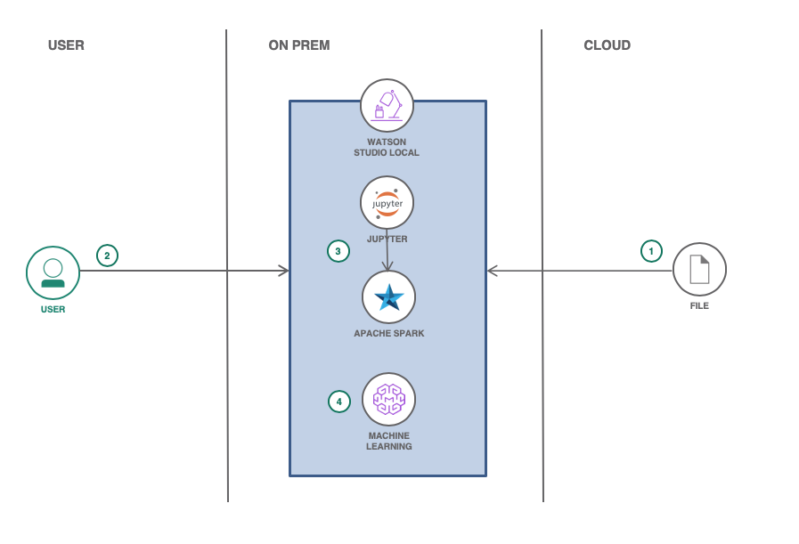

1. Load the wine classification dataset into Apache Hadoop HDFS running on HDP.
2. Use Spark DataFrame operations to clean the dataset and use Spark MLlib to train a PCA classification model.
3. Save the resulting model into DSX Local.
4. The user can run the provided notebooks in DSX Local.
5. As the notebook runs, Apache Livy will be called to interact with the Spark service in HDP.
6. Use IBM Deployment Manager to deploy and access the model to generate wine classification.

## Included components

* [IBM Data Science Experience Local](https://content-dsxlocal.mybluemix.net/docs/content/local/overview.html): An out-of-the-box on premises solution for data scientists and data engineers. It offers a suite of data science tools that integrate with RStudio, Spark, Jupyter, and Zeppelin notebook technologies.
* [Apache Spark](http://spark.apache.org/): An open-source, fast and general-purpose cluster computing system.
* [Hortonworks Data Platform (HDP)](https://hortonworks.com/products/data-platforms/hdp/): HDP is a massively scalable platform for storing, processing and analyzing large volumes of data. HDP consists of the essential set of Apache Hadoop projects including MapReduce, Hadoop Distributed File System (HDFS), HCatalog, Pig, Hive, HBase, Zookeeper and Ambari.
* [Apache Livy](https://livy.incubator.apache.org/): Apache Livy is a service that enables easy interaction with a Spark cluster over a REST interface.
* [Jupyter Notebooks](http://jupyter.org/): An open-source web application that allows you to create and share documents that contain live code, equations, visualizations and explanatory text.

## Featured technologies

* [Artificial Intelligence](https://medium.com/ibm-data-science-experience): Artificial intelligence can be applied to disparate solution spaces to deliver disruptive technologies.
* [Python](https://www.python.org/): Python is a programming language that lets you work more quickly and integrate your systems more effectively.

# Prerequisites

## Access to HDP Platform

The core of this code pattern is integrating Hortonworks Data Platform (HDP) and IBM DSX Local. If you do not already have an HDP cluster available for use, you will need to install one before attempting to complete the code pattern. 

To install [HDP v2.6.4](https://docs.hortonworks.com/HDPDocuments/HDP2/HDP-2.6.4/index.html), please follow the [installation guide](https://docs.hortonworks.com/HDPDocuments/Ambari-2.6.1.5/bk_ambari-installation/content/ch_Getting_Ready.html) provided by Hortonworks. It first requires the installation of the [Apache Ambari](https://ambari.apache.org/) management platform which is then used to faciliate the HDP cluster installation. The Ambari Server is also required to complete a number of steps described in the following sections.

> Note: Ensure that your Ambari Server is configured to use `Python v2.7`.

## Install HDP Cluster services

Once your HDP cluster is deployed, at a minimum, install the following services as listed in this Ambari Server UI screenshot:

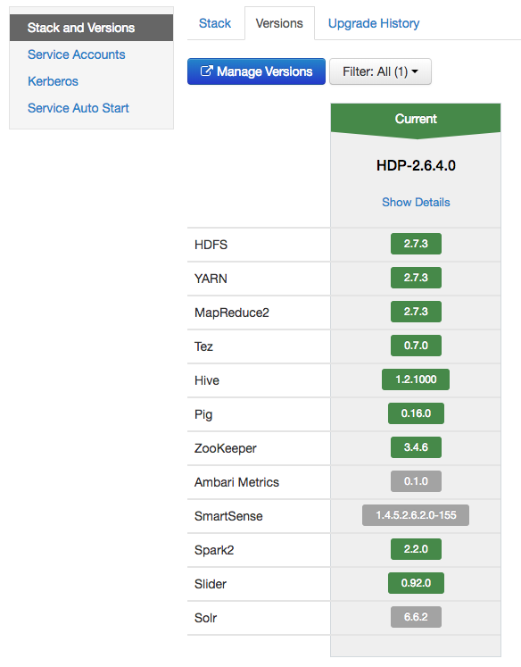

> Note: This code pattern requires that version `2.2.0` of the `Spark2` service be installed.

## Install DSX Local

https://content-dsxlocal.mybluemix.net/docs/content/local/welcome.html

## Install DSX Hadoop Integration Service (DSXHI) to integrate DSX Local with HDP

https://content-dsxlocal.mybluemix.net/docs/content/local/hadoopintegration.html

# Steps

Follow these steps to setup the proper environment to run our notebooks locally.

1. [Clone the repo](#1-clone-the-repo)
1. [Download and move data to HDFS on Hortonworks](#2-download-and-move-data-to-hdfs-on-hortonworks)
1. [Create project in IBM DSX Local](#3-create-project-in-ibm-dsx-local)
1. [Create project assets](#4-create-project-assets)
1. [Run the notebooks to create our model](#5-run-the-notebooks-to-create-our-model)
1. [Commit changes to DSX Local Master Repository](#6-commit-changes-to-dsx-local-master-repository)
1. [Create release project in IBM Deployment Manager](#7-create-release-project-in-ibm-deployment-manager)
1. [Deploy our model as a web service](#8-deploy-our-model-as-a-web-service)
1. [Deploy our scripts as a job](#9-deploy-our-scripts-as-a-job)
1. [Bring deployments on-line](#10-bring-deployments-on-line)
1. [Gather API endpoints data for use in scripts](#11-gather-api-endpoints-data-for-use-in-scripts)
1. [Modify scripts in DSX Local](#12-modify-scripts-in-dsx-local)
1. [Run scripts locally to test](#13-run-scripts-locally-to-test)
1. [Manage your model with the Deployment Manager](#14-manage-your-model-with-the-deployment-manager)

### 1. Clone the repo
```
git clone https://github.com/IBM/model-mgmt-on-dsx-local-and-hortonworks.git
```

### 2. Download and move data to HDFS on Hortonworks


### 3. Create project in IBM DSX Local

In DSX Local, we use projects as a container for all of our related assets. To create a project:

* From the DSX Local home page, select the `Add Project` button.


* Enter your project name and press the `Create` button.

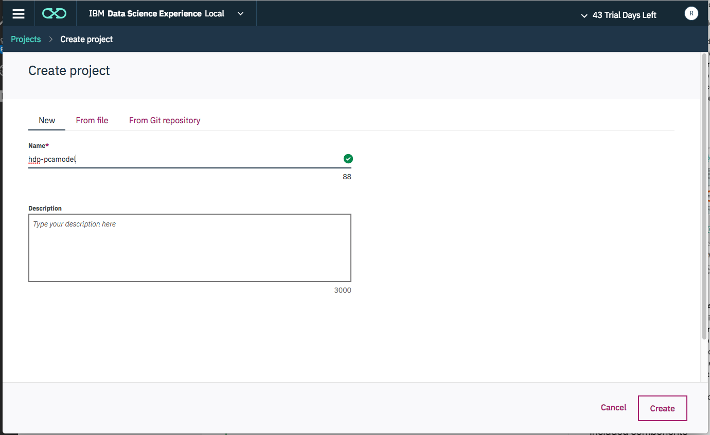

### 4. Create project assets

Once created, you can view all of the project assets by selecting the `Assets` tab from the project's home page.

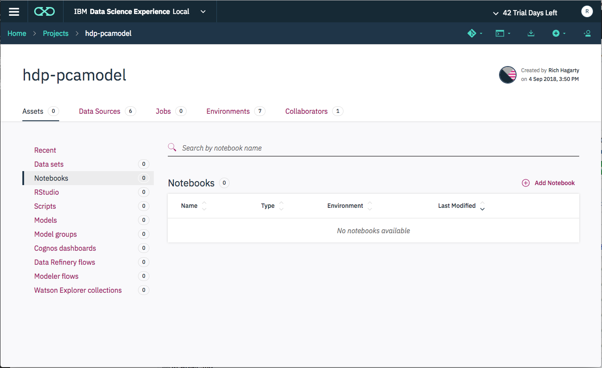

For our project, we need to add our notebooks and scripts. To add our notebooks:

* Select `Notebooks` in the project `Assets` list, then press the `Add Notebook` button.

* Enter a unique notebook name and use the `From URL` option to load the notebook from the github repo.

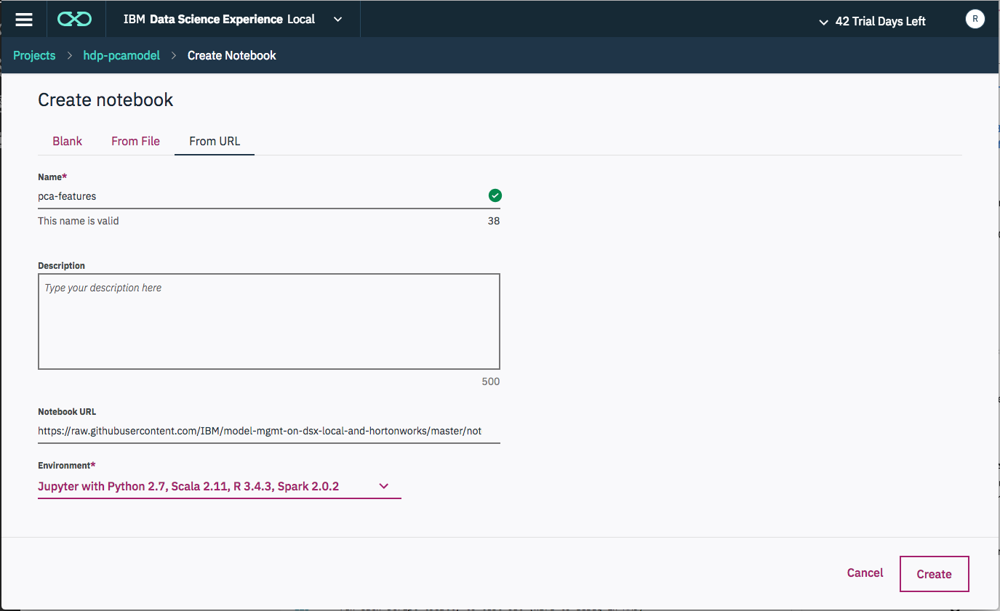

* Enter this URL:

```
https://raw.githubusercontent.com/IBM/model-mgmt-on-dsx-local-and-hortonworks/master/notebooks/pca-features.ipynb
```

* Repeat this step to add the second notebook, using the following URL:
```
https://raw.githubusercontent.com/IBM/model-mgmt-on-dsx-local-and-hortonworks/master/notebooks/pca-modeling.ipynb
```

To add our scripts:

* Select `Scripts` in the project `Assets` list, then press the `Add Script` button.

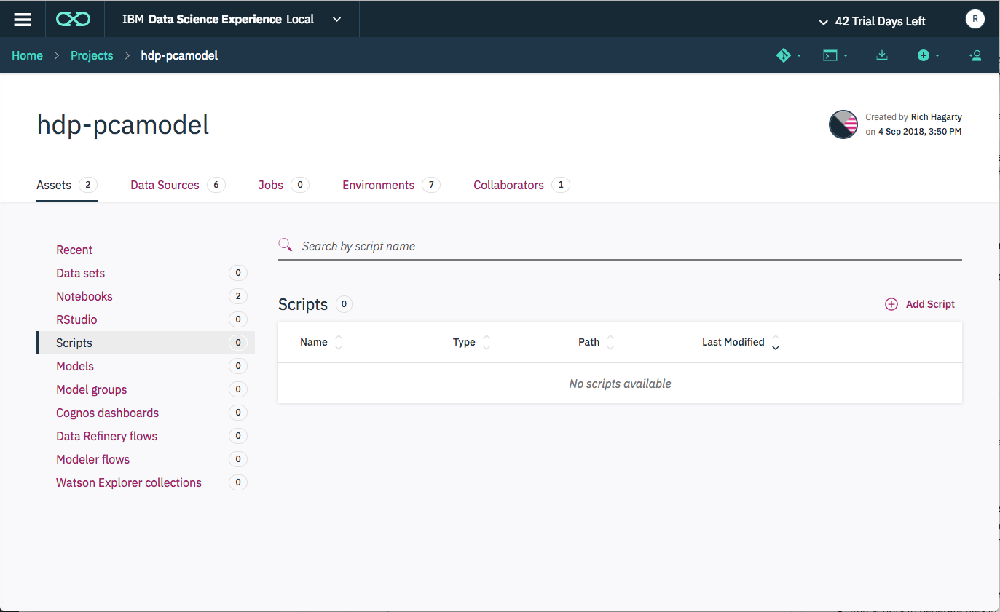

* Enter a unique script name and click on the `From File` tab. Use the `Drag and Drop` option to load the script file from your local repo.

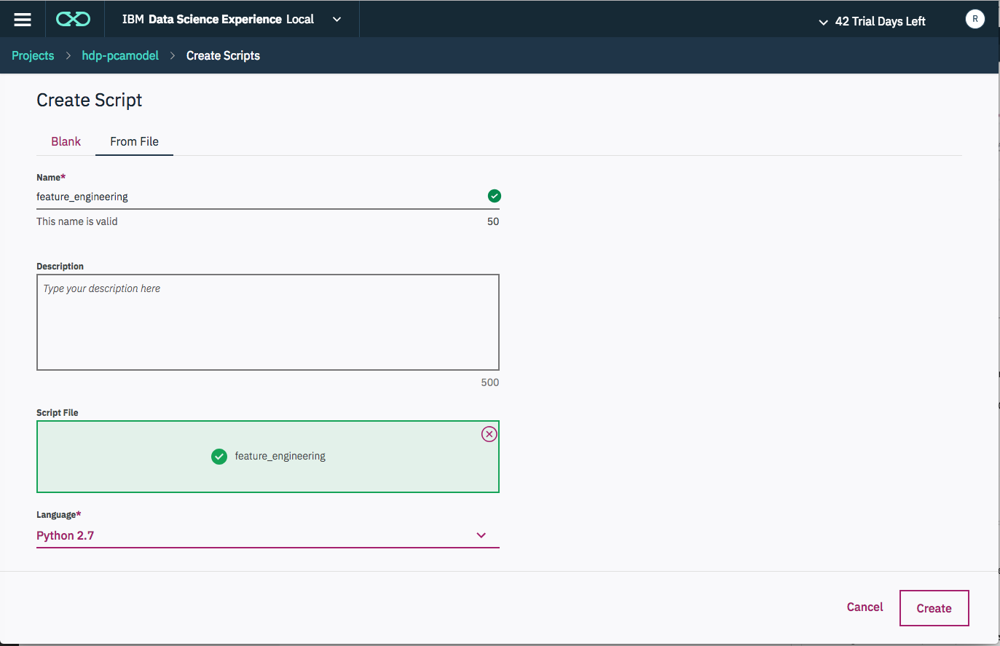

* Add the following scripts:
```
scripts/feature_engineering.py
scripts/extract_and_score.py
scripts/model_scoring.py
```

### 5. Run the notebooks to create our model

To view our notebooks, Select `Notebooks` in the project `Assets` list.

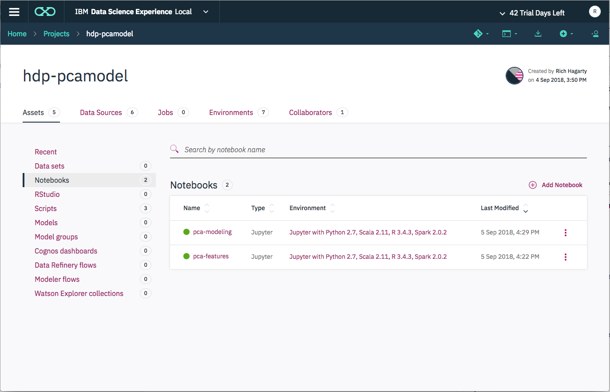

First, some background on how executing a notebooks: 

> When a notebook is executed, what is actually happening is that each code cell in
the notebook is executed, in order, from top to bottom.
>
> Each code cell is selectable and is preceded by a tag in the left margin. The tag
format is `In [x]:`. Depending on the state of the notebook, the `x` can be:
>
>* A blank, this indicates that the cell has never been executed.
>* A number, this number represents the relative order this code step was executed.
>* A `*`, which indicates that the cell is currently executing.
>
>There are several ways to execute the code cells in your notebook:
>
>* One cell at a time.
>   * Select the cell, and then press the `Play` button in the toolbar.
>* Batch mode, in sequential order.
>   * From the `Cell` menu bar, there are several options available. For example, you
    can `Run All` cells in your notebook, or you can `Run All Below`, that will
    start executing from the first cell under the currently selected cell, and then
    continue executing all cells that follow.
>* At a scheduled time.
>   * Press the `Schedule` button located in the top right section of your notebook
    panel. Here you can schedule your notebook to be executed once at some future
    time, or repeatedly at your specified interval.

To run a notebook, simply click on the notebook name from the `Notebooks` list.

* Run the `pca-features` notebook first. It reads in and transforms the wine data set. It also creates data files that will be required by the next notebook.

* Run the `pca-modeling` notebook, which generates and saves our data model.

Once the model is created, you can view it by selecting `Models` in the project `Asset` list. Note that it is given a default version number.

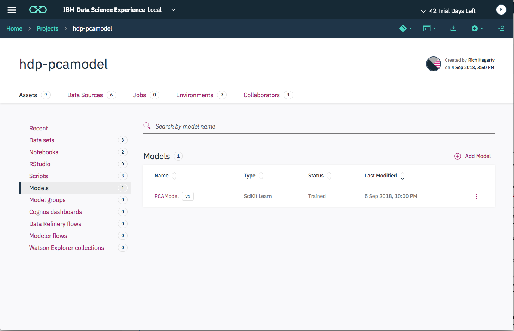

> Note: After executing the notebooks, you may be wondering why we just didn't combine all of the code into just a single notebook. The reason is simply to seperate out the the data processing steps from the model creation steps. This allows us to process any new data in the future without effecting our current model. In fact, this is exactly what should be done with any new data - score it against the current model first to determine if the results are still acceptable. If not, we can then run the second notebook to generate a new model.
>
> As you will see later, running the first notebook will be done by running a script in our project (`scripts/feature_engineering.py`). This script was initially created by loading the `pca-features` notebook into Jupyter, then exporting the notebook cells into a `python` script (use the menu options `File` -> `Download as` -> `Python (.py)`). We only had to modify the script slightly to include some code to handling data versioning.

### 6. Commit changes to DSX Local Master Repository

After making changes to your project, you will be occasionally reminded to commit and push your changes to the DSX Local Master Repoisory.


Now that we have added our notebooks and scripts, and generated our model, let's go ahead and do that. Commit and push all of our new assets, and set the version tag to `v1.0`.


### 7. Create release project in IBM Deployment Manager

The IBM Deployment Manager provides the mechanism to deploy our model as a web service. It manages `Project Releases`, which we will now create.

* Launch the IBM Deployment Manager by selecting it from the main drop-down menu on the DSX Local home page.

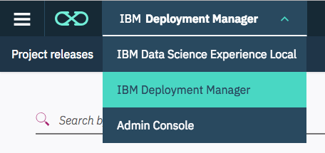

* From the `Project releases` page, press the `Add Project Release` button.

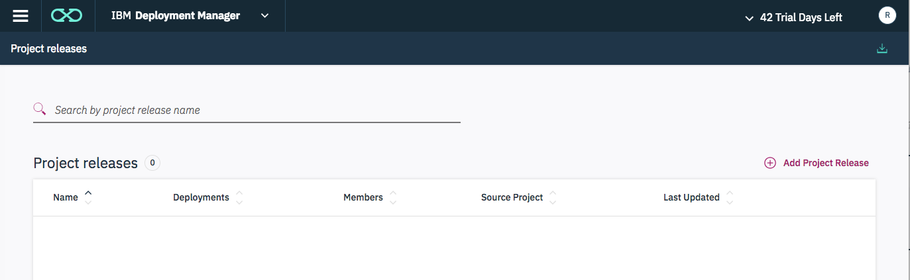

* Select our previously committed project from the `Source project` drop-down list, and select the version tag you assigned to the project. Give the release a `Name` and a `Route` (which can be any random string), and the press `Create`.

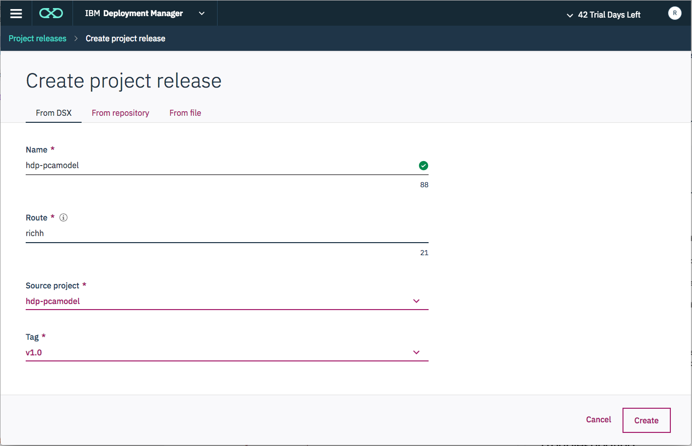

* If you click on the `Assets` tab, you will see all of the assets associated with the project.

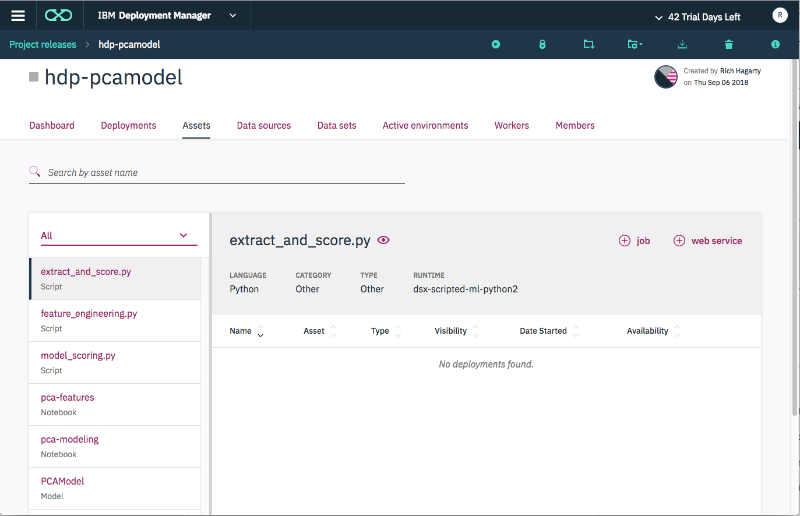

### 8. Deploy our model as a web service

* Select the model from the list of `Assets` associated with our project. From the model details panel, press the `web service` button.


* On the model deployment screen, provide a unique name, reserve some CPUs and memory, then press `Create`.

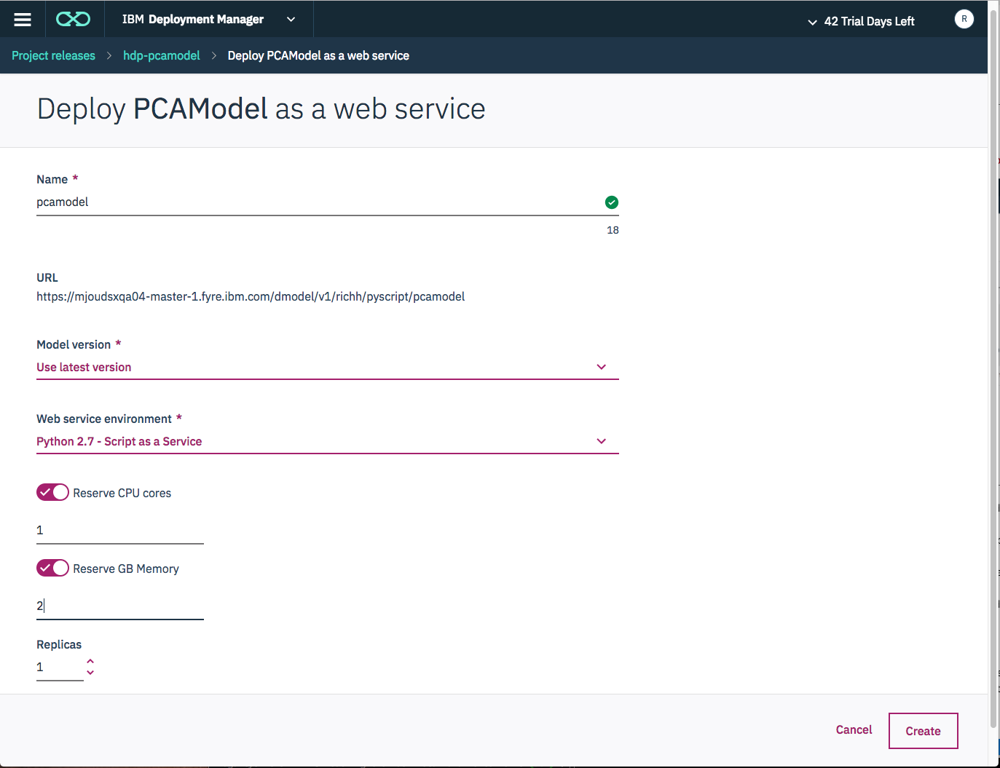

### 9. Deploy our scripts as a job

* From the details panel for the `feature_engineering.py` script, press the `job` button. 

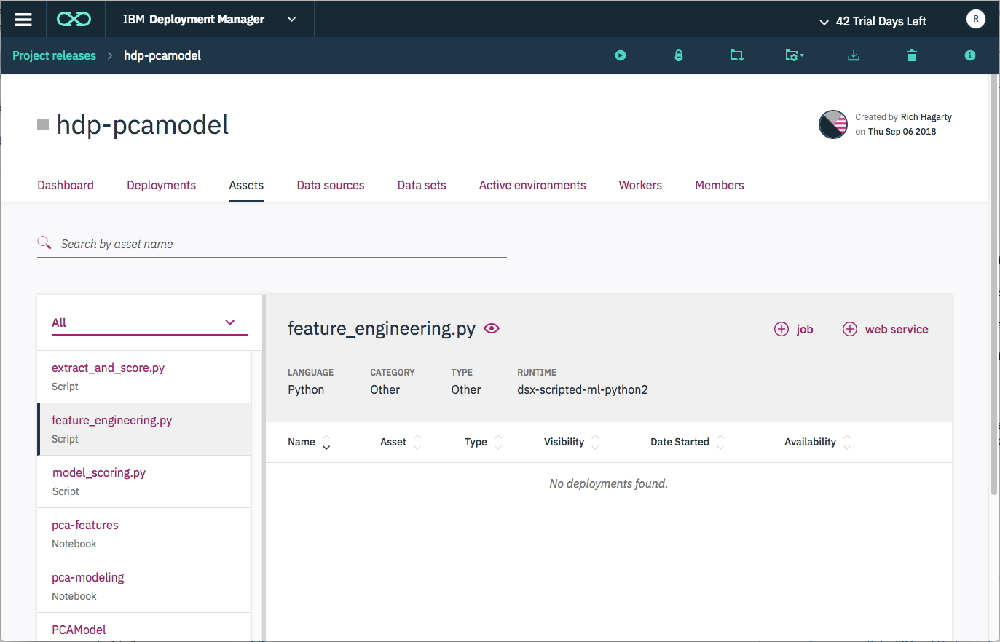

* On the script deploy screen, provide a job name, set the type to `Script run`, add `v1` as a command line argument, then press `Create`.

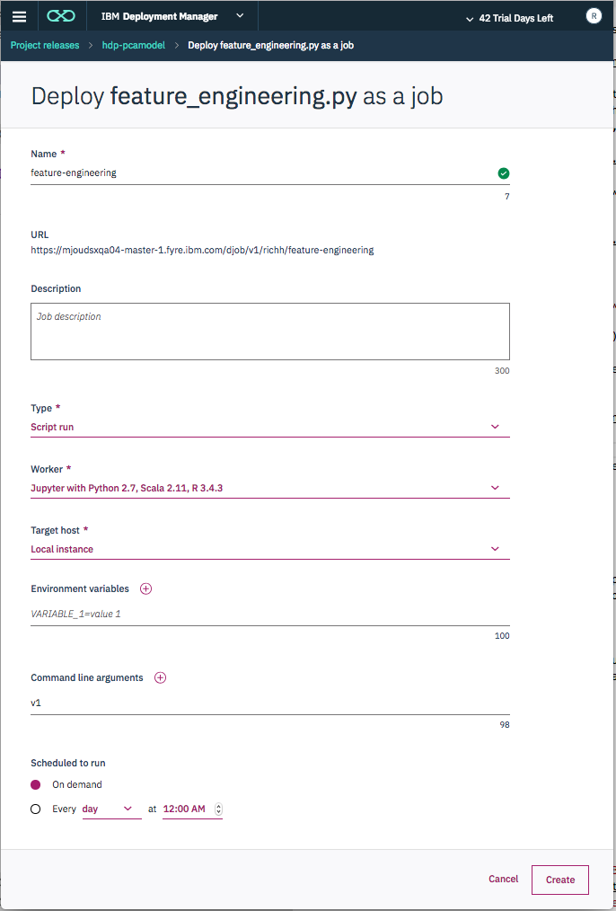

Repeat these steps for the remaining 2 scripts.

### 10. Bring deployments on-line

If you select the `Deployments` tab from the project page, you will notice that all of the deployments are listed as disabled.

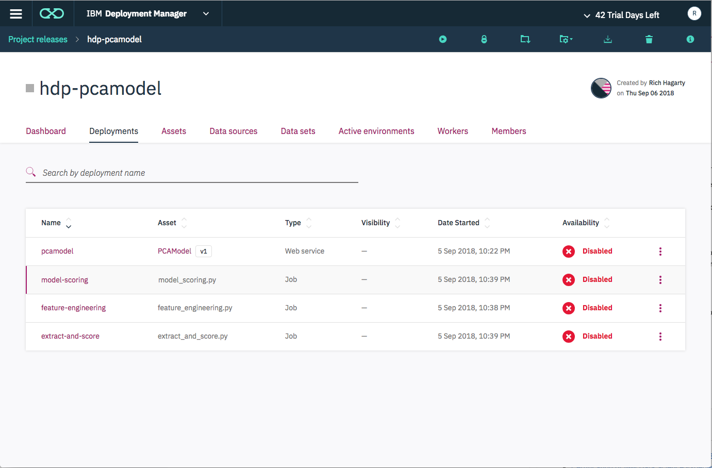

To bring the deployments on-line, press the `Play` button icon, which is the left-most icon listed at the top of the page. Once you complete the action, you should see the following.

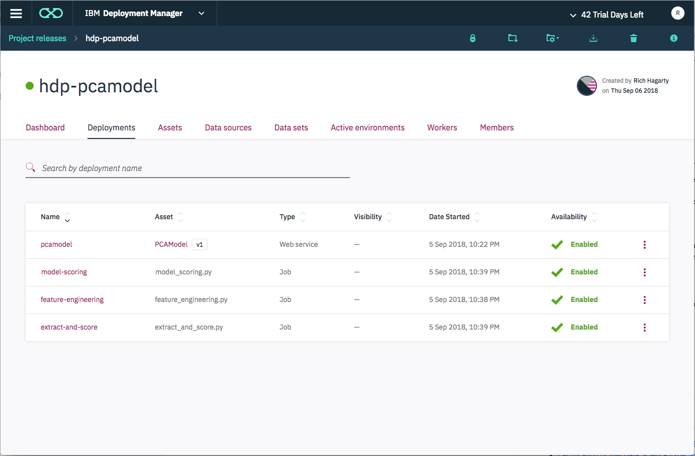

> Note: you may have to manually `Enable` the model deployment by using the menu options listed on the right side of the model row in the deployments table.

### 11. Gather API endpoints data for use in scripts

Some of our scripts will need access to our deployed model and, in some cases, to the other deployed scripts. 

Here is a quick overview of what our scripts do and require:

* **feature_engineering.py** - this script performs the same function as our `pca-features` notebook. It reads in data from the wine dataset, then applies machine learning techniques to transform the data. The output will be two data files - `features` and `target`. Note that theese data files will have a version tag appended to them so that their contents are not over-written every time that this script is run. This script does not require access to our model or other scripts.

* **model_scoring.py** - this script is a batch processor. It reads the `features` data file and scores each feature, one at a time, by running them through our model. The output will be a `scoring_output` data file. Note that the data file will have a version tag appended to it so that its contents are not over-written every time that this script is run. This script requires access to our deployed model.

* **extract_and_score.py** - this script was created for convenience, and can be used instead of running the previous scripts separately. It invokes the `feature_engineering` script first, then when complete, it invokes the `model_scoring` script. This script requires access to the other deployed scripts.

To access the deployed model or scripts, we need to gather the associated API endpoints and an authorization token. All of these values are available from the deployment pages for each of the objects. The endpoints will take on the following format:

* model endpoints will end in `/score`.
* script endpoints will end in either `/trigger`, `/status`, or `/cancel` (which corresponds to the actions: `start`, `status`, and `stop`).

To get the endpoint for our deployed model, click on the model from the `Assets` tab of the project page.  

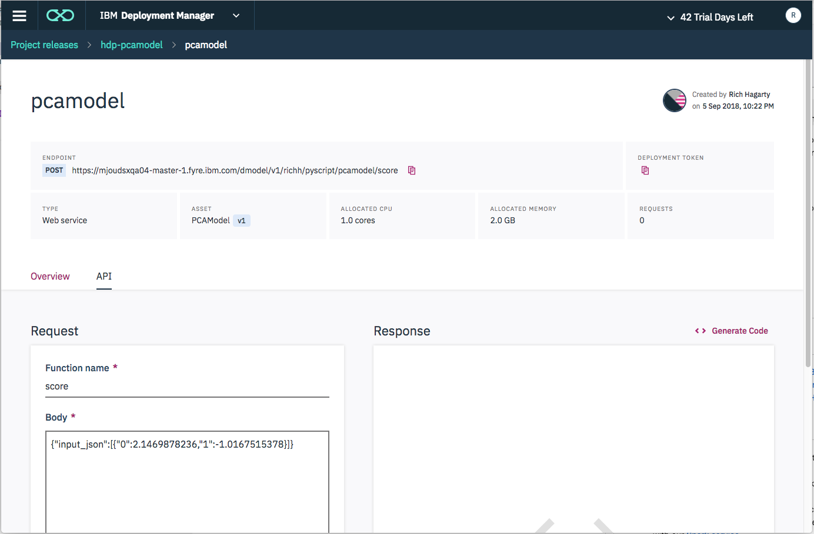

The endpoint is listed at the top of the page. Both the `Endpoint` and the `Deployment Token` can be saved to the clipboard by clicking on their respective  icons.

Repeat this step to retrieve the endpoints for both the `feature_engineering` and `model_scoring` scripts. 

> Note: You will only need to get one copy of the `Deployment Token`. It will be the same for all deployments within this project.

### 12. Modify scripts in DSX Local

Once we have gathered our deployment endpoints and deployment token, we need to go back to `DSX Local` mode so that we can modify and test our scripts.

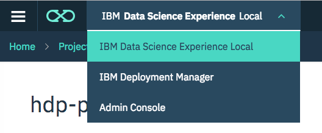

Go to the `Assets` list for the project, and select `Scripts`. Click on a script file to open it up in edit mode. 

The scripts we will be modifying are those that reference deployment objects. These are:

```
scripts/model_scoring.py
scripts/extract_and_score.py
```
* For the `model_scoring` script, substitute in the token and endpoint values.

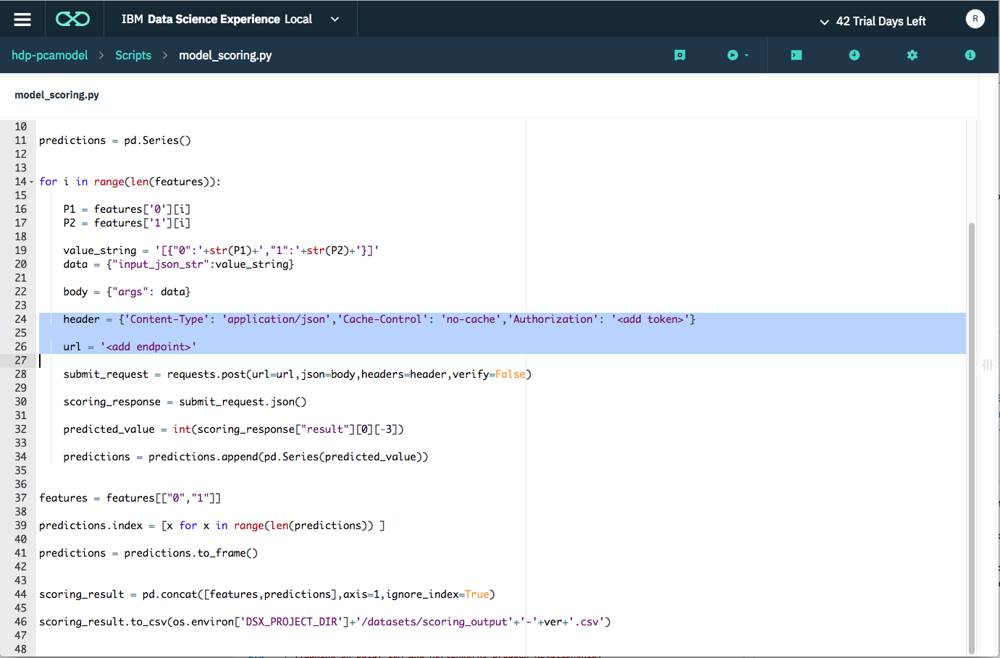

* For the `extract_and_score` script, substitute in the token and endpoint values. The endpoints values are for the `feature_engineering` and `model_scoring` deployment scripts. If your enpoint ends with `/trigger`, remove it. The script will append both the `/trigger` and `/status` functions to both endpoints, as needed.

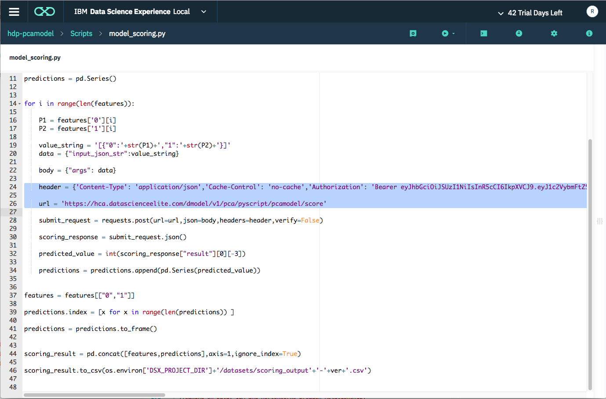

### 13. Run scripts locally to test

To avoid having to go back and forth between DSX Local and the Deployment Manager (which includes re-deploying with creating new release versions), make sure the scripts run locally in DSX Local first.

* From the project page, click on `Scripts` in the `Assets` list.  

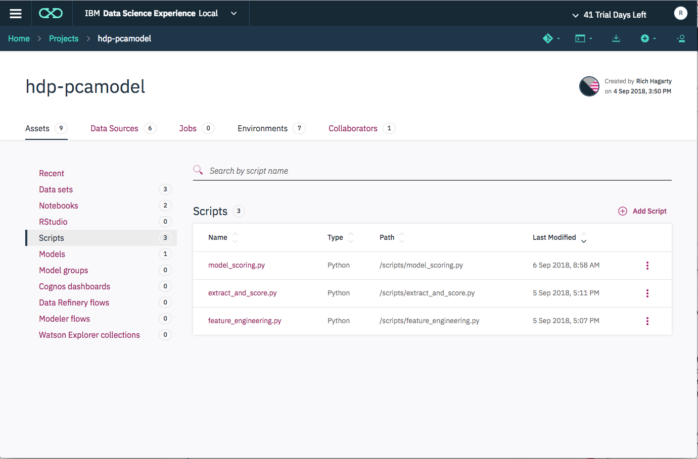

Start with the script `feature_engineering`. Use the menu bar on the right side of the script row to `Create Job` and run the script.

In the `Create Job` run panel, provide a unique name and make sure you use the following options:
  * Type: `Script Run`
  * Target host: `Local instance`
  * Source asset: `/scripts/feature_engineering.py`
  * Command line arguments: `v1`

After you press the `Create` button, you will see the run panel. 

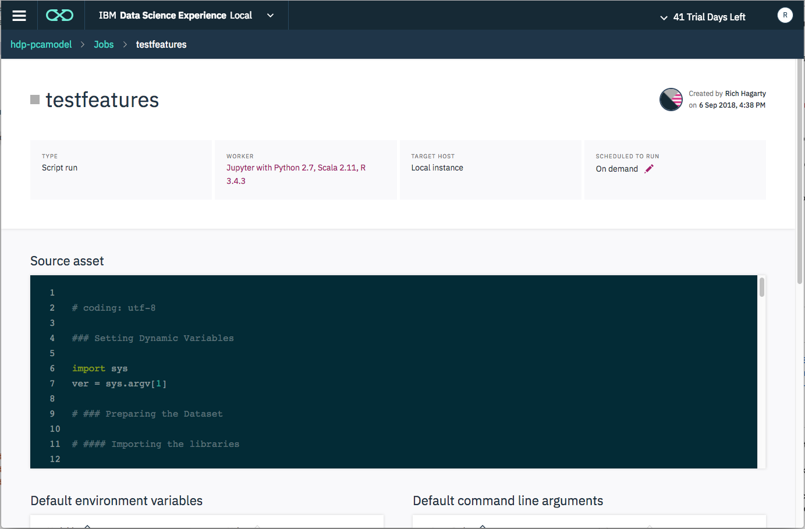

If you scroll down a bit, you will see a `Run Now` button. Click it to start the script. Again, you will be presented with a dialog that requires you give it a run name. The rest of the values will be defaulted to values you already set, so they do not need to be modified. Click the `Run` button to run the script.

You will be transferred back to the run panel where you can see the status (listed under `Duration`) and a tail of the log file. Once completed successfully, you should see 2 new files listed under `Data sets` in the `Assets` list.

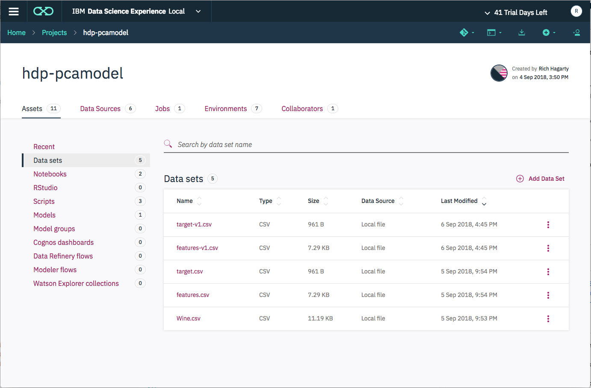

> Note: The created data files (`target` and `features`) have a version tag appended to their name. This matches the command line argument we passed into the script.

Repeat this process to run the `model_scoring` script. And if that completes successfully, run the `extract_and_score` script.

Once you have verified that all of the scripts are working, commit and push the changes 
to the DSX Local Master Repository, as described above in [Step #6](#6-commit-changes-to-dsx-local-master-repository). Make sure you bump the version number.

### 14. Manage your model with the Deployment Manager

Launch the IBM Deployment Manager by selecting it from the main drop-down menu on the DSX Local home page.


First we need to update our release project to grab all of the latest versions of our scripts.

* From the Deployment Manager home page, click on our project tile.

* From the row of icons listed in the page banner, click on the `Update` icon.

* From the update screen, use the `Source project` drop-down menu to select our DSX Local project. Then select the version tag associated with our latest commit.

Now that all of our assets are updated, we can actually manage our model by tracking its use and performance.

To get the ball rolling, let's start by running our `extract_and_score` script. As explained previously, this will read in the current wine csv file and transform it, then score each wine against our model.

* From the `Asset` page, select the `extract_and_score` script. From the detail page, click on the script name to bring up the script launch page. Then click on the `API` tab.

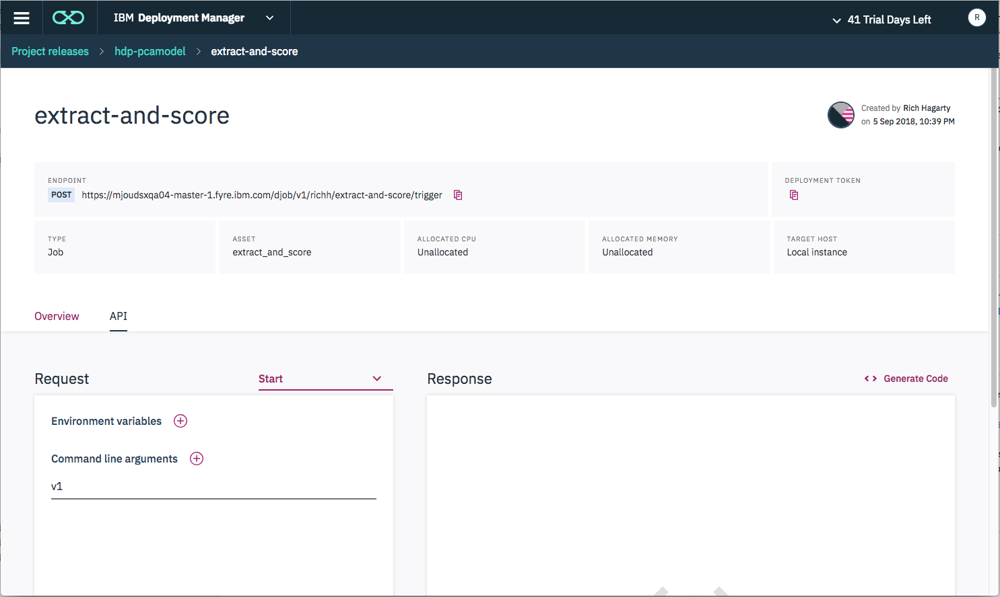

* Note that the `Command line arguments` value is set to `v1`. You can set this to anything you want, but it will be appended to the file names generated by this script. This is how to avoid overridding the data from previous runs of this script.

* To run the script, click on the `Overview` tab and scroll down to the `Runs` section of the page. Then click the `run now` button.

* From the start dialog, enter a name, modify the command line argument if needed, then click the `Run` button.

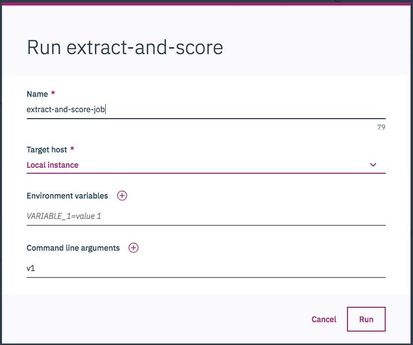

* You can view the status of the job from the same panel. In the case of the `extract-and-score` script, three separate jobs will be launched (the main script, and the calls to the other scripts). 

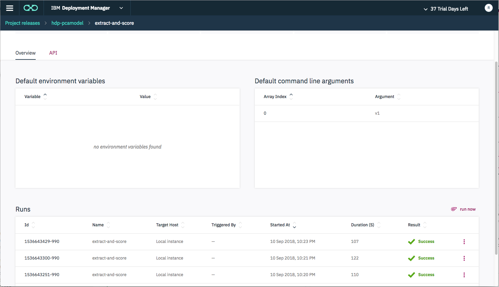

Now that the model has been accessed, we can monitor ...

# Troubleshooting

* An error was encountered: Session XX unexpectedly reached final status 'dead'. See logs: java.lang.Exception: No YARN application is found with tag livy-session-XX in 120 seconds. Please check your cluster status, it is may be very busy.

If you see this error trying to start a remote Spark session (which is attempted in the pca-features notebook), it may indicate that the username that you logged into DSX Local with has not been registered on the HDP Hadoop cluster.

# Links

* [Teaming on Data: IBM and Hortonworks Broaden Relationship](https://hortonworks.com/blog/teaming-data-ibm-hortonworks-broaden-relationship/)
* [Certification of IBM Data Science Experience (DSX) on HDP is a Win-Win for Customers](https://hortonworks.com/blog/certification-ibm-data-science-experience-dsx-hdp-win-win-customers/)
* [An Exciting Data Science Experience on HDP](https://hortonworks.com/blog/exciting-data-science-experience-hdp/)

# Learn more

* **Data Analytics Code Patterns**: Enjoyed this Code Pattern? Check out our other [Data Analytics Code Patterns](https://developer.ibm.com/code/technologies/data-science/)
* **AI and Data Code Pattern Playlist**: Bookmark our [playlist](https://www.youtube.com/playlist?list=PLzUbsvIyrNfknNewObx5N7uGZ5FKH0Fde) with all of our Code Pattern videos
* **Watson Studio**: Master the art of data science with IBM's [Watson Studio](https://datascience.ibm.com/)
* **Spark on IBM Cloud**: Need a Spark cluster? Create up to 30 Spark executors on IBM Cloud with our [Spark service](https://console.bluemix.net/catalog/services/apache-spark)

# License
[Apache 2.0](LICENSE)
